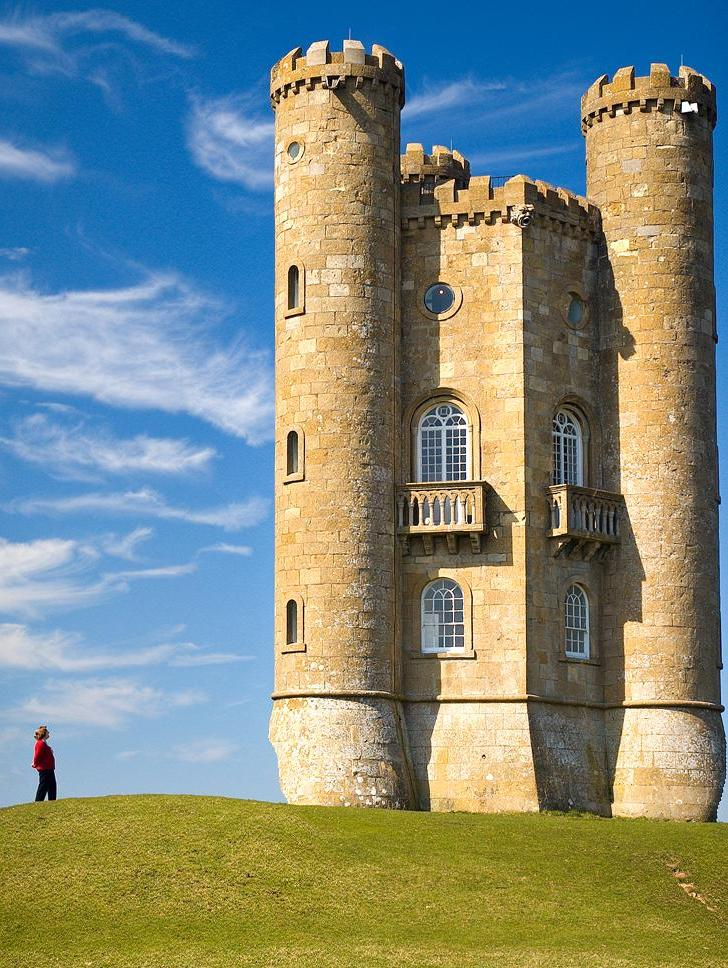
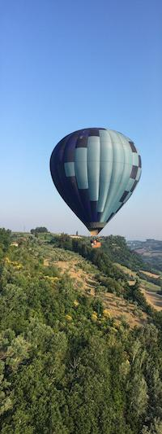
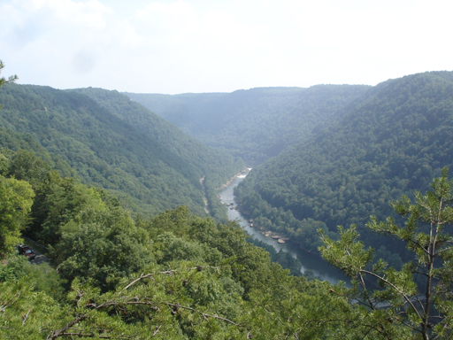
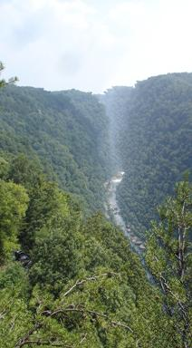

# Seam Carving

Implementation of a seam carving algorithm in "Seam carving for content-aware image resizing" by Shai Avidan and Ariel Shamir.

The algorithm is as follows:

1. Compute the gradient of the image.
2. Compute the cumulative energy map with the gradients. An energy value at a pixel measures its contrast with its neighboring pixels. If we're computing a vertical energy map, then for every pixel starting from the second row, we take the value of the magnitude of the gradient at the current pixel, then the minimum of the pixels that are its neighbors from the row above the current pixel. The algorithm is symmetric for a horizontal energy map. We can use dynamic programming or Dijikstra's algorithm to compute the energy map.
3. Find the pixel with the minimum energy value at the last row for a vertical energy map or last column for horizontal energy map.
4. Backtrace from the pixel found in step 3 all the way to the first row to get the vertical seam.
5. Remove the seam from the image.
6. Repeat steps 1-5 n-1 times to remove n seams.

## Some results

### Input

Note: this image has been scaled to fit by the markdown file
### Output (700 vertical seams removed)

### Input

### Output (200 vertical seams removed)

### Input

### Output (300 vertical seams removed)

### Input

### Output (200 vertical seams removed)

### Input

### Output (200 vertical seams removed)
