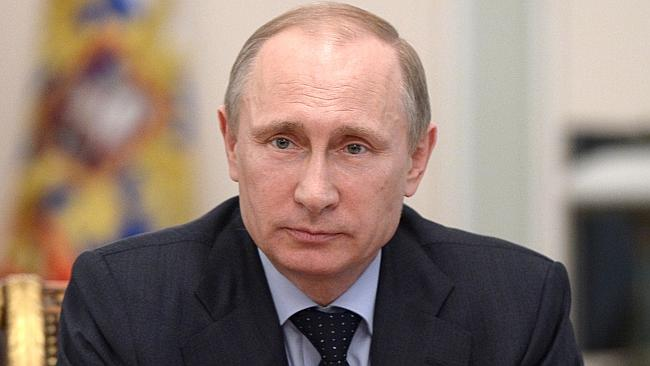
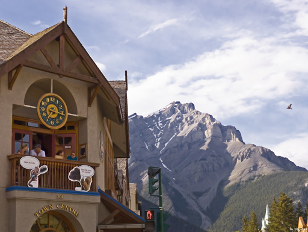
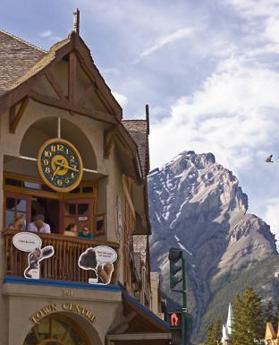

# Seam Carving

## Some results

### Input

### Output (700 vertical seams removed)

### Input

### Output (200 vertical seams removed)

### Input

### Output (300 vertical seams removed)

### Input

### Output (200 vertical seams removed)

### Input

### Output (200 vertical seams removed)
